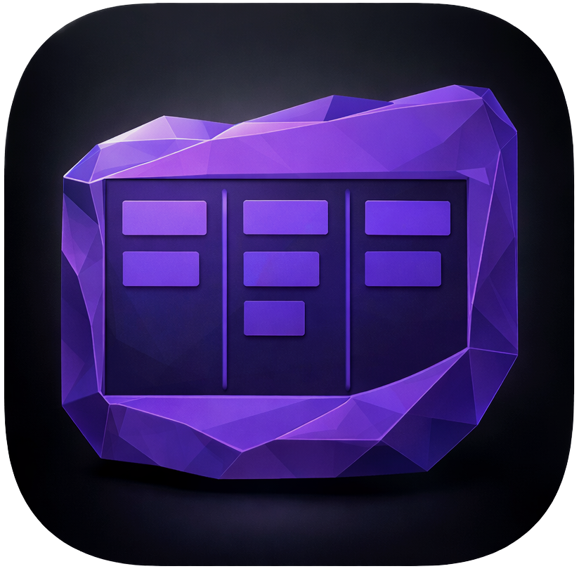
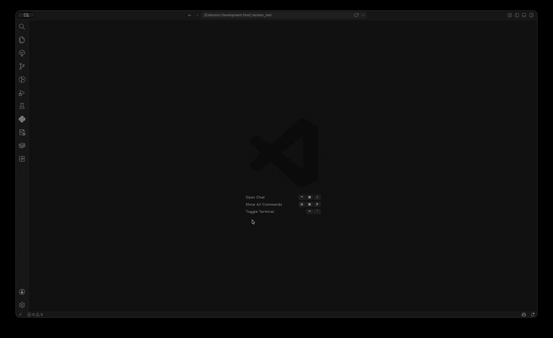
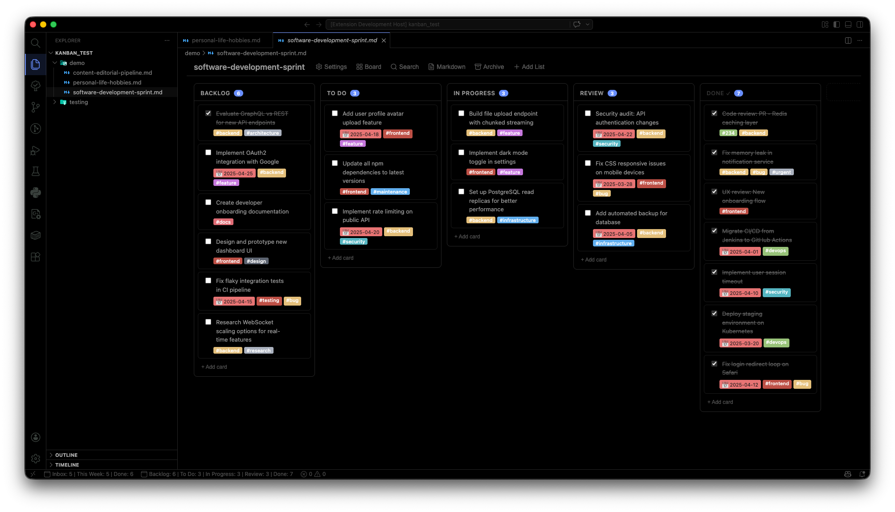
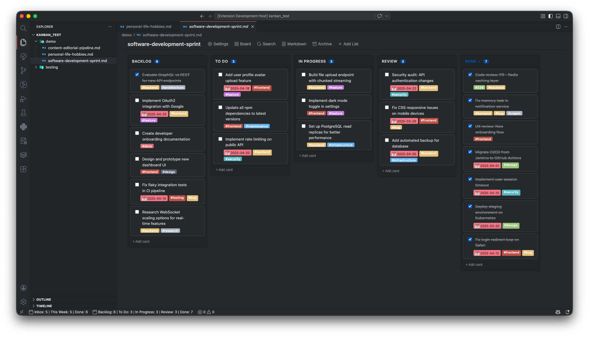
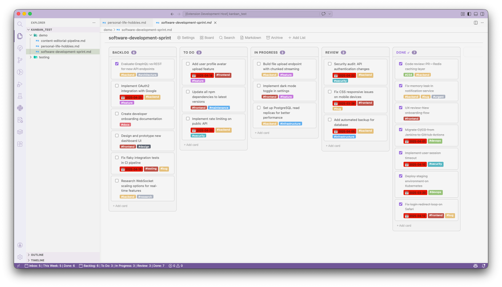
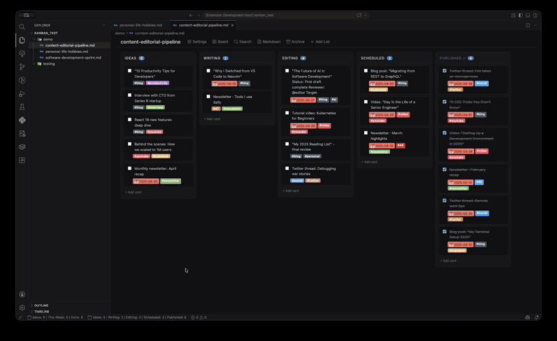
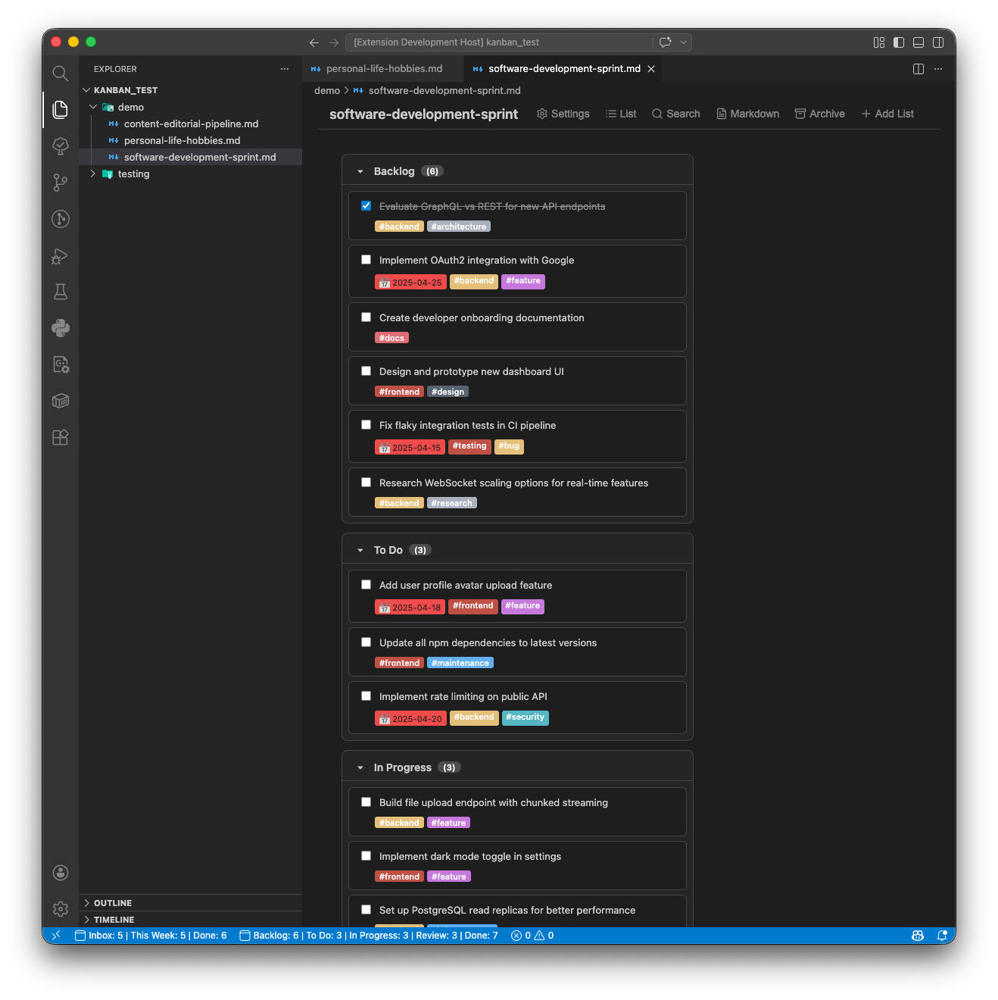
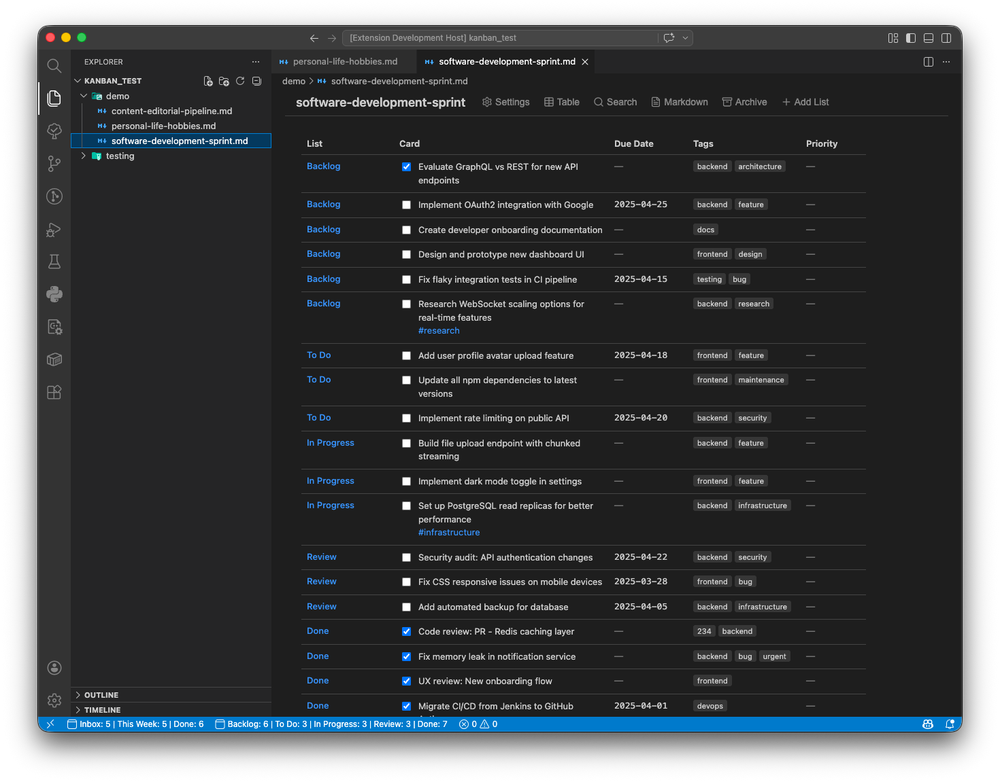
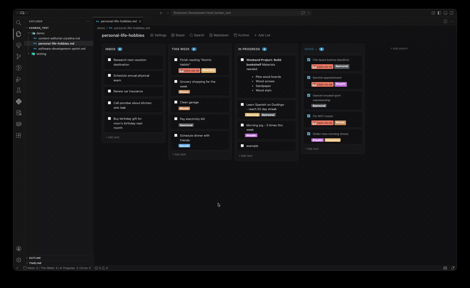

<div align="center">
  

# Unified Kanban

### One kanban format for Obsidian and Visual Studio Code

[![TypeScript][typescript-badge]][github-repo-link]
[![React][react-badge]][github-repo-link]
[![Version][version-badge]][github-repo-link]
[![License: MIT][license-badge]][license-link]
[![Coverage][codecov-badge]][codecov-badge-link]
[![CI][ci-badge]][github-ci-badge-link]

[![VS Code Marketplace][vscode-marketplace-badge]][vscode-marketplace-link]
[![VS Code][vscode-version-badge]][vscode-link]

</div>

## Why Unified Kanban?

Every markdown kanban extension on VS Code invents its own unique syntax. Switching between Obsidian and Visual Studio Code means rewriting your boards from scratch. It's impossible to learn one _standard_ markdown syntax to use when creating kanban boards. The [Obsidian Kanban][obsidian-kanban-plugin-link] plugin has emerged as the de facto standard — battle-tested and widely adopted. **Unified Kanban** bridges the gap, finally bringing that proven format to VS Code so your boards work identically in both editors.

**One kanban format, unified!**

## Contents

- [Installation](#installation)
- [Getting Started](#getting-started)
- [See It In Action](#see-it-in-action)
- [The Markdown Format](#the-markdown-format)
- [Features](#features)
- [Settings](#settings)
- [Commands](#commands)
- [FAQ](#faq)
- [Troubleshooting](#troubleshooting)
- [Changelog](#changelog)
- [Support & Community](#support--community)
- [Contributing](#contributing)

## Installation

Install from the VS Code Marketplace:

1. Open the **Extensions** sidebar (`Ctrl`+`Shift`+`X` / `Cmd`+`Shift`+`X`)
2. Search for **Unified Kanban**
3. Click **Install**

Or use Quick Open (`Ctrl`+`P` / `Cmd`+`P`):

```bash
ext install divisionseven.unified-kanban
```

## Getting Started

### Opening a Board

**Recommended use:** This extension is designed to work with markdown kanban boards — either boards you created with this extension or with the [obsidian-kanban plugin][obsidian-kanban-plugin-link]. These files contain YAML frontmatter with `kanban-plugin: basic`.

1. Right-click any `.md` kanban file in the Explorer
2. Select **Open With...** → **Kanban Board**

Or use the Command Palette:

- **Kanban: New Board** — creates a new kanban board with all required frontmatter

**What about regular `.md` files?**
If you open a non-kanban `.md` file, the extension will attempt to render any `##` headings as lists and `- [ ]` items as cards. However, anything else in the file will be ignored. If you change any board settings, the extension will automatically add the required settings footer to your document.

**Compatibility note:** While Unified Kanban is flexible about the YAML frontmatter section being included, the Obsidian kanban plugin requires proper YAML frontmatter to recognise the document as a kanban board. Any new boards created using this extension will include **all** required fields to work perfectly in both Obsidian and here.

## See It In Action

### Basic Usage

See how Unified Kanban turns markdown files into interactive kanban boards.

<p align="center">
  
</p>

<p align="center"><sub>Create boards → Add cards with markdown → Drag to reorder → Archive when done</sub></p>

### Theme Support

Unified Kanban automatically adapts to your editor's color theme.

<p align="center">
    
</p>

<p align="center"><sub>Watch Unified Kanban seamlessly match your editor's color scheme — light, dark, or ultra dark</sub></p>

<p align="center">
  
</p>

<p align="center"><sub>The extension detects your active theme and instantly updates colors in real-time</sub></p>

### View Modes

Three views to match your workflow — Board for visual planning, List for quick scanning, Table for detailed overviews.

<p align="center">
   
</p>

<p align="center"><sub>Switch between Board, List, and Table views at any time</sub></p>

### Rich Markdown Editing

Open the original markdown document with one click. Edit in the kanban editor, or with full markdown support.

<p align="center">
  
</p>

<p align="center"><sub>Rich text, tags, dates, checklists, and custom fields — all inline</sub></p>

## The Markdown Format

Unified Kanban uses the same markdown format as the popular [obsidian-kanban plugin][obsidian-kanban-plugin-link]. Using this extension, your boards are now seamlessly portable between Obsidian and VS Code.

```markdown
---
kanban-plugin: basic
---

## Todo

- [ ] Task one #tag @{2025-04-15}
- [ ] Task two [[linked-note]]

## In Progress

- [ ] Task three

## Done

**Complete**

- [x] Done task

%% kanban:settings
{"kanban-plugin":"basic","lane-width":270,"date-format":"YYYY-MM-DD","time-format":"HH:mm"}
%%
```

**Format rules:**

- YAML frontmatter must include `kanban-plugin: basic`
- Each `##` heading becomes a list
- `- [ ]` for open cards, `- [x]` for completed cards
- `#tag-name` — rendered as colored badges
- `@{YYYY-MM-DD}` — rendered as urgency-colored chips
- `[[note-name]]` — clickable to open linked notes
- `%% kanban:settings %%` — per-board settings (JSON)
- `**Complete**` — marks the archive section for done cards

## Features

Unified Kanban includes 20+ features for your project boards:

- **Drag-and-drop** — Reorder cards and columns with intuitive drag interactions
- **Three view modes** — Board, Table, and List views to match your workflow
- **Rich content** — Tags, dates, wikilinks, and custom metadata with inline editing
- **Per-board settings** — 30+ customization options including themes, dates, and behavior
- **Theme-aware design** — Automatically adapts to your active VS Code color theme
- **Archive system** — Organize completed cards with date-stamped archives

[View all 20+ features →][features-link]

## Settings

Per-board settings are configured via the gear icon in the board toolbar and stored in the markdown file's `%% kanban:settings %%` block:

| Setting                   | Default      | Description                                                     |
| ------------------------- | ------------ | --------------------------------------------------------------- |
| `lane-width`              | `270`        | Column width in pixels (150–600)                                |
| `date-format`             | `YYYY-MM-DD` | Display format for dates                                        |
| `time-format`             | `HH:mm`      | Display format for times                                        |
| `prepend-new-cards`       | `false`      | Add new cards to the top of a column instead of the bottom      |
| `show-checkboxes`         | `true`       | Show checkboxes on cards                                        |
| `new-card-insertion`      | `append`     | How new cards are inserted (prepend, prepend-compact, append)   |
| `hide-card-count`         | `false`      | Hide the card count badge on column headers                     |
| `move-tags`               | `true`       | Extract tags from card text and display as metadata             |
| `tag-action`              | `obsidian`   | Tag click behavior: `kanban` (filter) or `obsidian` (search)    |
| `move-dates`              | `true`       | Extract dates from card text and display as metadata            |
| `date-trigger`            | `@`          | Character that triggers date autocomplete                       |
| `time-trigger`            | `@`          | Character that triggers time autocomplete                       |
| `date-display-format`     | `YYYY-MM-DD` | Format for displaying dates on cards                            |
| `show-relative-date`      | `false`      | Show dates as relative (e.g., "in 3 days")                      |
| `link-date-to-daily-note` | `false`      | Make date metadata link to daily notes                          |
| `date-picker-week-start`  | `1`          | Day the date picker starts on (0=Sunday, 1=Monday)              |
| `archive-with-date`       | `false`      | Add a date stamp when archiving cards                           |
| `append-archive-date`     | `false`      | Append date to end of archived card text                        |
| `archive-date-separator`  | ` `          | Separator between card text and archive date                    |
| `archive-date-format`     | `YYYY-MM-DD` | Date format for archive date stamps                             |
| `max-archive-size`        | `-1`         | Maximum cards in archive (-1 for unlimited)                     |
| `metadata-position`       | `body`       | Where to display inline metadata (body, footer, metadata-table) |
| `move-task-metadata`      | `true`       | Extract Obsidian Tasks metadata from card text                  |
| `new-note-template`       | `""`         | Template content for new notes created from cards               |
| `new-note-folder`         | `""`         | Folder path for new notes created from cards                    |
| `show-add-list`           | `true`       | Show the "Add List" button in the board header                  |
| `show-archive-all`        | `true`       | Show the "Archive All" button in the board header               |
| `show-view-as-markdown`   | `true`       | Show the "View as Markdown" button in the board header          |
| `show-board-settings`     | `true`       | Show the board settings button in the board header              |
| `show-search`             | `true`       | Show the search button in the board header                      |
| `show-set-view`           | `true`       | Show the set view button in the board header                    |
| `show-title`              | `true`       | Show the board title (filename or custom)                       |
| `custom-title`            | `""`         | Custom title to display (overrides filename when set)           |

## Commands

| Command                    | Title                       | Description                                     |
| -------------------------- | --------------------------- | ----------------------------------------------- |
| `kanban.newBoard`          | Kanban: New Board           | Create a new kanban board from template         |
| `kanban.openAsText`        | Kanban: Open as Text        | Reopen the current board as plain markdown      |
| `kanban.archiveDoneCards`  | Kanban: Archive Done Cards  | Move all completed cards to the archive section |
| `kanban.toggleKanbanView`  | Kanban: Toggle Kanban View  | Toggle between kanban board and text view       |
| `kanban.convertToKanban`   | Kanban: Convert to Kanban   | Convert the current file to kanban format       |
| `kanban.addKanbanLane`     | Kanban: Add Kanban Lane     | Add a new lane to the current board             |
| `kanban.viewBoard`         | Kanban: View as Board       | Switch to board view                            |
| `kanban.viewTable`         | Kanban: View as Table       | Switch to table view                            |
| `kanban.viewList`          | Kanban: View as List        | Switch to list view                             |
| `kanban.openBoardSettings` | Kanban: Open Board Settings | Open the board settings panel                   |

## FAQ

For additional questions and solutions, see the [FAQ documentation][faq-link].

### How do I exclude kanban files from markdown linters?

Since kanban files use non-standard markdown syntax, linters may flag them with errors. For full instructions on configuring your specific linter, see the [FAQ documentation][faq-link].

**Quick patterns that work:**

- Use filename patterns (e.g., `*board*.md`, `*-kanban.md`)
- Exclude the kanban directory (e.g., `kanban/`, `boards/`)

## Troubleshooting

Having issues? Check the [FAQ][faq-link] for common questions and solutions.

## Changelog

See [CHANGELOG.md][changelog-link] for the full release history and version notes.

## Support & Community

[![GitHub issues][github-issues-badge]][github-issues-link]
[![GitHub discussions][github-discussions-badge]][github-discussions-link]

- [Report issues][github-issues-link]
- [Join discussions][github-discussions-link]

## Contributing

See [CONTRIBUTING.md][contributing-link] for development setup, code style, and how to submit changes.

## License

Unified Kanban is distributed under the [MIT License][license-link]

## Acknowledgments

- [Obsidian][obsidian-link] — the amazing note-taking app that inspired this project
- [obsidian-kanban][obsidian-kanban-plugin-link] — the established markdown format that makes this project possible
- [dnd-kit][dnd-kit-link] — drag-and-drop library
- [Lucide][lucide-link] — beautiful open-source icons
- [VS Code Extension API][vscode-api-link] — documentation and samples

## Disclaimer

> Unified Kanban is not affiliated with [Obsidian][obsidian-link] or with the [obsidian-kanban][obsidian-kanban-plugin-link] plugin.

---

<!-- Header Badges -->

[vscode-marketplace-badge]: https://img.shields.io/badge/VS%20Code%20Extension-Unified%20Kanban-8A2BE2?style=plastic&logo=visual-studio-code
[vscode-version-badge]: https://img.shields.io/badge/VS%20Code%20Version-1.85+-8A2BE2?style=plastic
[typescript-badge]: https://img.shields.io/badge/TypeScript-5.x-8A2BE2?style=plastic&logo=typescript&logoColor=white
[react-badge]: https://img.shields.io/badge/React-18.x-8A2BE2?style=plastic&logo=react&logoColor=white
[codecov-badge]: https://img.shields.io/codecov/c/github/divisionseven/unified-kanban?logo=codecov&style=plastic&color=8A2BE2&logoColor=white
[ci-badge]: https://img.shields.io/github/actions/workflow/status/divisionseven/unified-kanban/ci.yml?branch=main&logo=github&style=plastic&color=8A2BE2&logoColor=white
[version-badge]: https://img.shields.io/badge/Version-0.6.1-8A2BE2.svg?style=plastic&logo=git&color=8A2BE2&logoColor=white
[license-badge]: https://img.shields.io/badge/License-MIT-blue?style=plastic&logo=open-source-initiative&color=8A2BE2&logoColor=white

<!-- Body Badges -->

[github-issues-badge]: https://img.shields.io/github/issues/divisionseven/unified-kanban?color=8A2BE2&style=plastic
[github-discussions-badge]: https://img.shields.io/github/discussions/divisionseven/unified-kanban?color=8A2BE2&style=plastic

<!-- VS Code -->

[vscode-marketplace-link]: https://marketplace.visualstudio.com/items?itemName=divisionseven.unified-kanban
[vscode-api-link]: https://code.visualstudio.com/api
[vscode-link]: https://code.visualstudio.com/

<!-- GitHub CI / Coverage -->

[github-ci-badge-link]: https://github.com/divisionseven/unified-kanban/actions/workflows/ci.yml
[codecov-badge-link]: https://app.codecov.io/gh/divisionseven/unified-kanban

<!-- GitHub Repo -->

[github-repo-link]: https://github.com/divisionseven/unified-kanban
[github-issues-link]: https://github.com/divisionseven/unified-kanban/issues
[github-discussions-link]: https://github.com/divisionseven/unified-kanban/discussions

<!-- Acknowledgments -->

[obsidian-link]: https://obsidian.md
[obsidian-kanban-plugin-link]: https://github.com/mgmeyers/obsidian-kanban
[dnd-kit-link]: https://github.com/clauderic/dnd-kit
[lucide-link]: https://lucide.dev

<!-- Documentation -->

[license-link]: LICENSE.md
[features-link]: docs/FEATURES.md
[faq-link]: docs/FAQ.md
[changelog-link]: CHANGELOG.md
[contributing-link]: CONTRIBUTING.md
